# m.AI Tutor - Personalized Math Tutor for Underprivileged Students

| Project Name | m.AI Tutor |
| --- | --- |
| Team | 열정-5o |
| Competition | 5th SKT FLY AI Challengers |

## 📚 Project Overview

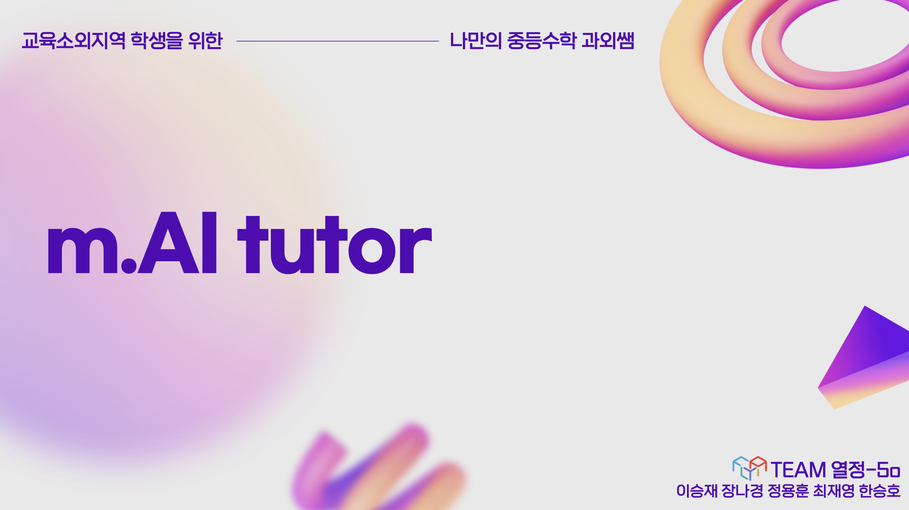

m.AI Tutor is a personalized AI-driven math tutoring platform aimed at bridging the education gap for students in underserved regions. Our platform provides real-time math tutoring, helping students in areas where access to private tutoring and quality education is limited. The system leverages advanced AI technology to provide interactive, personalized learning experiences.

## 🎯 Purpose and Motivation

Many students in rural or educationally underserved areas suffer from a lack of access to qualified math tutors. The project seeks to address the following key issues:

	•	Educational inequality between metropolitan areas and rural regions.
	•	Lack of access to real-time assistance and resources in math education.
	•	Limited opportunities for personalized learning in areas with few or no educational institutions.

## 🌟 Key Features

1.	AI-Powered Tutoring:

    • Real-time, personalized math tutoring.

    • AI-driven problem-solving engine capable of interpreting bothtext and handwritten math problems.
2.	OCR (Optical Character Recognition):

    • Integration with Google Vision, OpenCV, and other advanced toolsto interpret handwritten problems.

    • Can recognize and solve math problems using a mix of GoogleVision, Claude, and Llama 3.1 engines.
3.	User Progress Feedback:

    • Constant monitoring of user performance (e.g., user statedetection: “Doing,” “Wrong,” “Solve”, or "Delay").

    • Feedback and adaptive learning paths based on individualperformance.
4.	Educational Data Analysis:

    • Analyzes user learning data, including problem-solving accuracyand time spent on tasks.

    • Generates reports and progress tracking for users, teachers, andparents.
5.	Gamification:

    • Ranking system to encourage competitive learning.

    • Rewards based on learning achievements to boost engagement.

## 📑 System Architecture

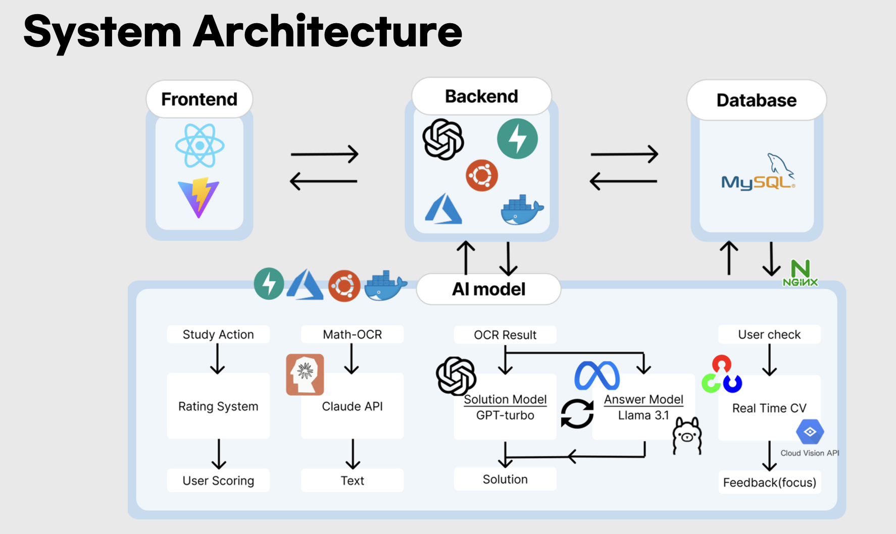

The platform consists of the following components:

1.	Math Problem Processing Engine:
    
    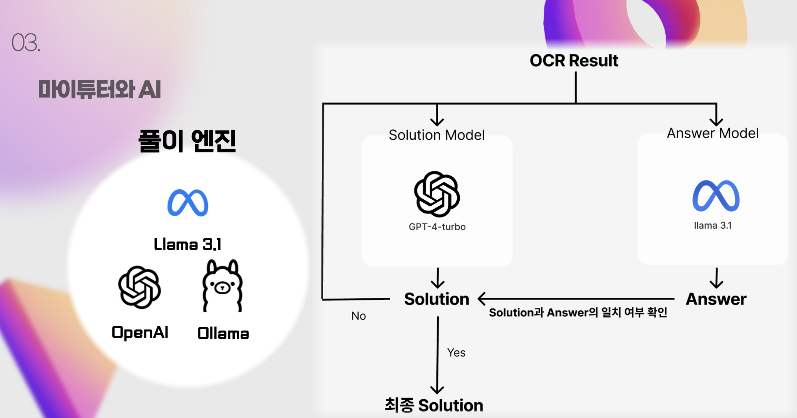

	• LLM-Based Math Problem Processing Engine:

        • The engine processes math problems using AI models, primarily GPT-4-turbo and Llama 3.1.

        • It is structured with a Solution Model, which handles the step-by-step solution process, and an Answer Model, which provides the final answer.

	• Solution Engine and Answer Validation Structure:
    
	> The engine is designed with reference to math evaluation benchmarks like GSM8K and MATH:
	
        • GSM8K serves as the benchmark for evaluating the correctness of the final answer and has a high SOTA (State-of-the-Art) score of around 95 out of 100.
	
        • MATH, on the other hand, focuses on evaluating the solution process and has a relatively lower SOTA score of around 85.
	
        • Given the lower accuracy of solution processes, the system first uses the Solution Model to generate a full solution, including all intermediate steps, and compares this result with the outcome from the Answer Model.
	    • If the results from the Solution Model and the Answer Model differ, the Solution Model is rerun to improve the accuracy by incorporating the final answer provided by the Answer Model.
	• Enhancing Accuracy through Model Integration:
	    
        • Supports multiple formats of math problem input, including text and handwritten problems.
	    • GPT-4-turbo is responsible for analyzing the solution process, while Llama 3.1 cross-verifies the final answer, ensuring a higher degree of accuracy.
	    • Technologies from Ollama and OpenAI are integrated to provide enhanced learning performance, minimize errors, and deliver reliable answers to students.

2. Real-Time Problem-Solving Logic:

    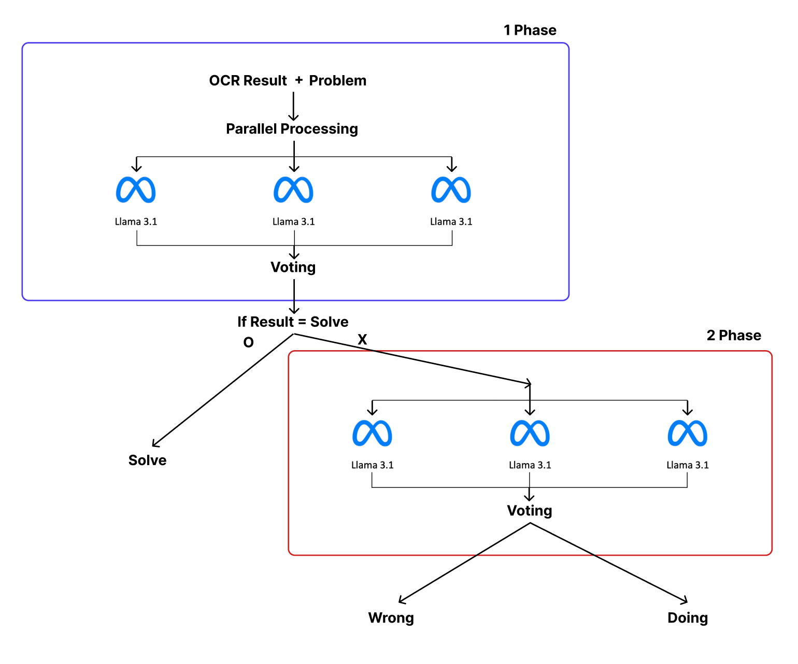

	•	The initial real-time interaction relied on a single-phase approach, where only one instance of the LLM (Llama 3.1) was used to process each query. However, this often produced inconsistent results, with some cases being correct and others incorrect. To address this, we introduced a two-phase system with voting for greater accuracy.

	•	Voting System for Enhanced Accuracy: To improve the reliability of the results, we opted for a voting system where three separate Llama 3.1 instances process the input in parallel. This allows us to aggregate their outputs and make a decision based on the majority vote, ensuring more robust outcomes.

	•	Two-Phase Approach for Problem State Classification: The problem state is categorized into three possibilities: solve, wrong, and doing. We observed that while the model generally identifies solve accurately, distinguishing between wrong and doing can be ambiguous. Therefore, the two-phase approach was designed to first filter out solve, and then apply a second round of inference to differentiate between wrong and doing.

	•	Three-Vote Decision Process: The decision to use three votes was made based on practical considerations. Each inference with Llama 3.1 takes approximately 2.5 seconds, and our experiments show that up to three votes can be processed within an acceptable time frame, balancing both speed and accuracy.

3. OCR (Optical Character Recognition):

    

        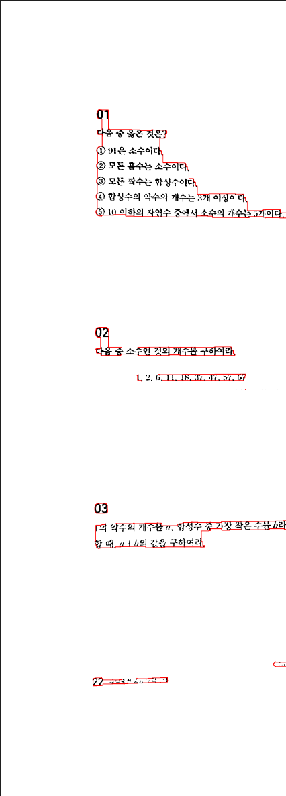
        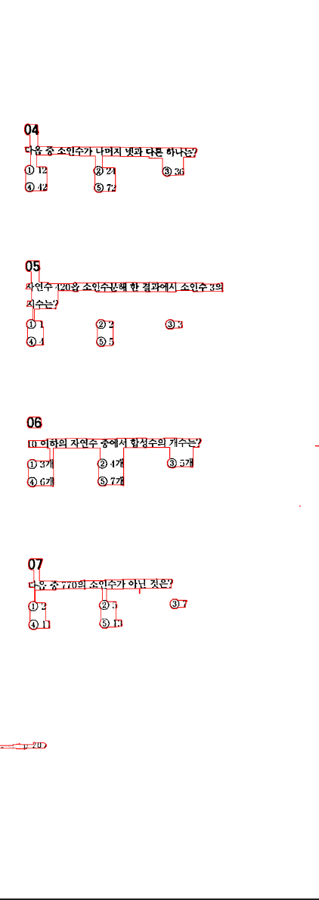
        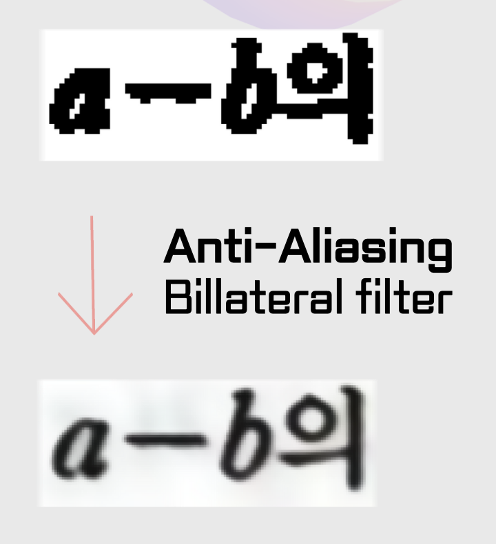
    

    To utilize OCR for math problems, we compared several models and APIs. After our evaluation, we found that building a custom OCR model specifically for math problems + Korean was not feasible due to insufficient data. Therefore, we decided to leverage existing APIs.

	> For printed text problems, the Claude API provided the best performance.
    >
	> For handwritten text, Google Vision OCR showed the highest accuracy, so we used both APIs depending on the type of input.

    To process an entire math workbook using OCR, we first segmented the problem areas in the images, as shown in the first picture, and saved each problem as a separate image file. Then, we applied bilateral filtering to the images to perform anti-aliasing, which significantly improved the accuracy of the OCR results (as shown in the second picture).

4. BackEnd Socket Control:

    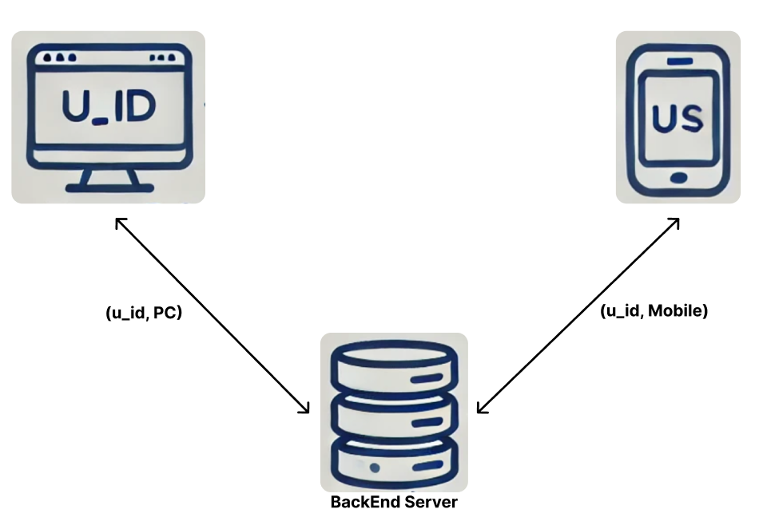

    The system supports both web and mobile platforms for front-end interaction. When a user begins studying, the backend receives two streams of data via socket communication:

        •	Web: Captures the user’s webcam feed.
        •	Mobile: Captures the problems the user is solving in real time.

    Both streams send framedata to the backend every 1 second via the socket connection. The data is managed as an object identified by the user’s u_id and the device type (web or mobile). This approach allows for efficient real-time processing and synchronization between the user’s devices during study sessions.

    The system is implemented with two separate socket connections in a server-mediated fashion, which functions similarly to a WebRTC-like setup, though it does not use peer-to-peer communication. Instead, all data is routed through the server for processing.

    Additionally, the backend only retains the most recent 10 seconds of framedata in local storage, ensuring minimal storage overhead while keeping the most relevant data for processing.

5. Learning Progress Dashboard:

    >The dashboard provides a comprehensive overview of the user’s learning progress and includes the following key features:

    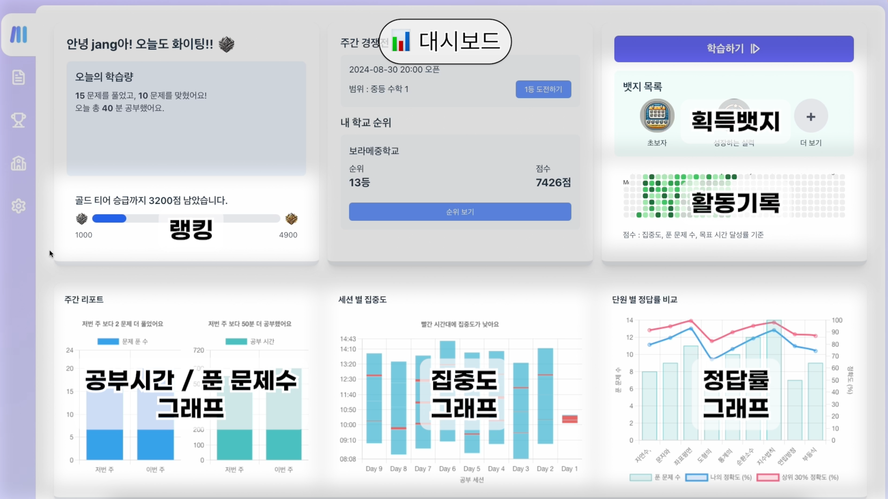

	• Today’s Learning Summary: Displays the number of problems solved, correct answers, and total study time for the day.
    
	• Ranking: Shows the user’s current ranking and progress toward the next tier, with a visual bar indicating the points required to advance.

	• Weekly Competition: Offers details about upcoming competitions, including subject area and current rankings within the user’s school.

	• Badges: A section dedicated to displaying the badges earned by the user, such as “Beginner” and “Achiever” with the option to view more.

	• Activity Record: Shows a visual heatmap that tracks focus, number of problems solved, and time goals.

	• Weekly Report: Includes graphs comparing this week’s problem-solving count and study time with last week’s performance.

	• Focus by Session: A graph that illustrates the user’s focus level across different study sessions.

	• Accuracy Rate: Compares the user’s accuracy in solving problems across different subjects, showing personal accuracy versus class averages.

6. User Interface:

    > The user interface is designed to offer a smooth and interactive learning experience, featuring the following key elements:

    

        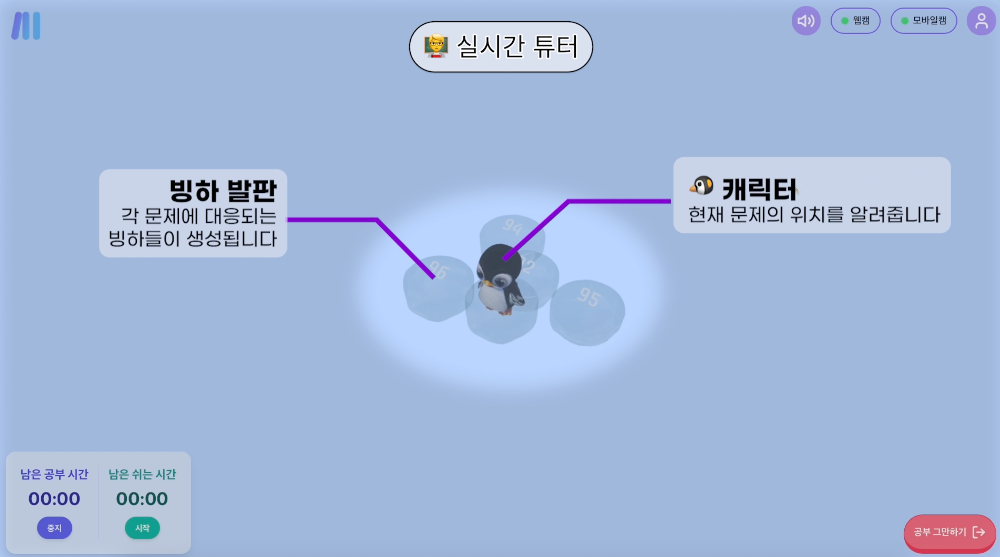
        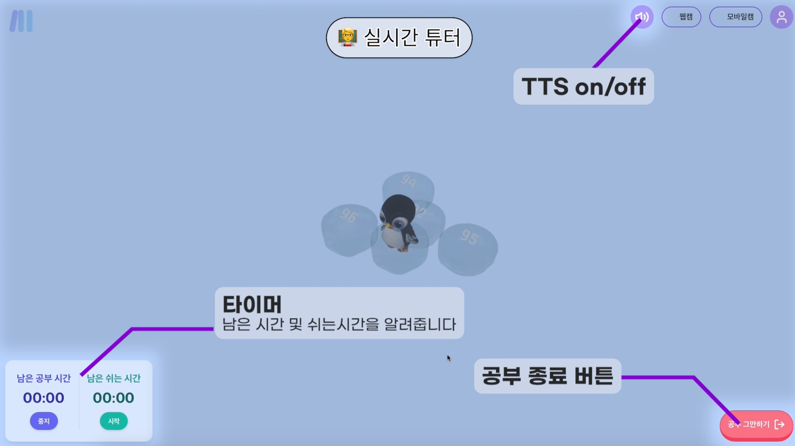
    

    

        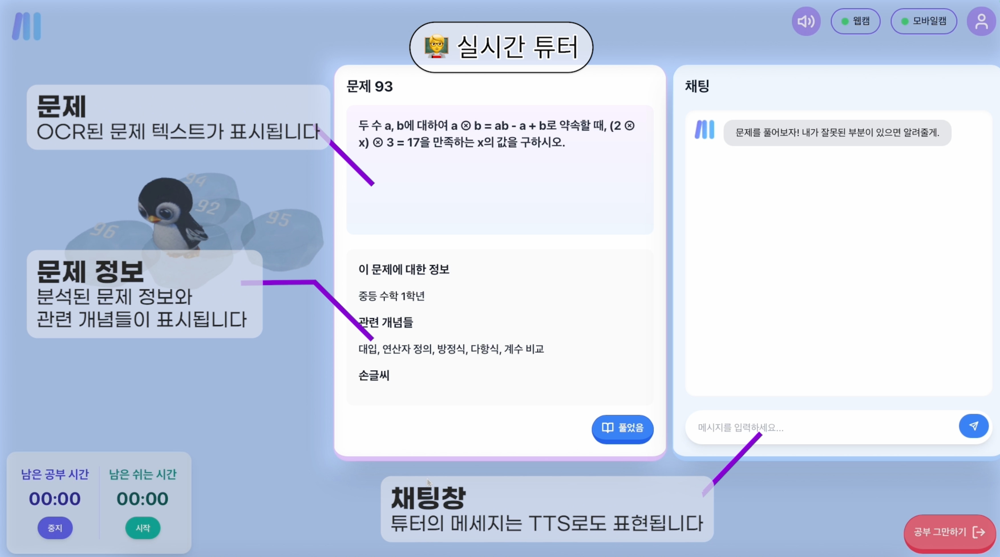
        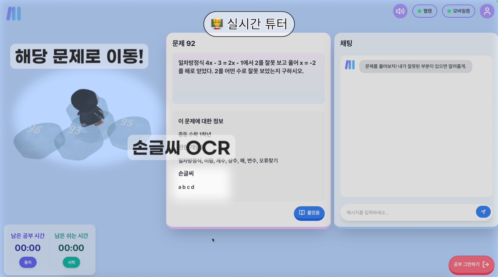
    

	• Problem Display: The OCR-processed text of the current problem is clearly displayed in a box, allowing the user to easily follow along with the real-time tutor’s guidance.
	
    • Problem Information: Each iceberg on the screen represents an individual problem. Users can click on an iceberg to view and solve the associated problem. This visual representation helps students quickly identify and engage with problems.
	
    • Chat Window: On the right side, the chat window allows the AI to solve problems in real-time, providing additional explanations and feedback. If a user makes a mistake, the AI corrects it and automatically suggests the right solution. Additionally, chat messages can be heard through the TTS (Text-to-Speech) feature, enhancing the learning experience with more flexibility.
	
    • Character Navigation: The penguin character visually guides the user’s learning progress. If the user starts solving a different problem on their mobile device, computer vision (CV) processing detects that the new problem is being solved, and the penguin character automatically moves to the next problem, ensuring a seamless transition between tasks.
	
    • Timer & Study Control: A timer in the bottom left tracks the remaining study and break time. This helps students stay focused and manage their time effectively. There are also buttons to start or pause the session.

## 🌍 Social Impact & ESG (Environmental, Social, and Governance)

Our mission is to reduce the educational inequality between urban and rural students by providing personalized AI tutoring for students in underdeveloped regions. Through m.AI Tutor, we aim to:

	• Close the education gap by offering high-quality tutoring services.
	• Promote educational equity by delivering math learning tools to underprivileged students.
	• Support sustainable development goals (SDGs) related to quality education (SDG 4).

## 🚀 Potential Applications

 1.	Primary Market: Education-starved regions where access to private tutoring is limited.
 2.	Commercial Market: Extended services for urban students who require personalized tutoring, possibly as a premium paid service.
 3.	Educational Institutions: Collaborations with schools and educational organizations to provide supplementary tutoring.

## 💼 Future Plans

• Expansion to cover more subjects beyond math.

• Improved AI Models: Continuous improvement of AI-driven tutoring for better personalization.

• Mobile App Development: Ensure accessibility through both web and mobile platforms.

## 🛠️ Technology Stack

| Part | FrameWork |
| --- | --- |
| FrontEnd |   |
| BackEnd |  
| AI |      
| Deployment |      |

## Our Team

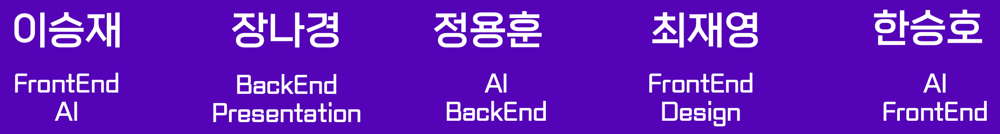

| Name     | Roles                | Github | 
|----------|----------------------| --- | 
| 이승재   | FrontEnd, AI          | https://github.com/JerryLee3305 |
| 장나경   | BackEnd, Presentation | https://github.com/jangnaa |
| 정용훈   | AI, BackEnd           | https://github.com/hun9008 |
| 최재영   | FrontEnd, Design      | https://github.com/jaeyoungchoi1 |
| 한승호   | AI, FrontEnd          | https://github.com/Hanssamho |